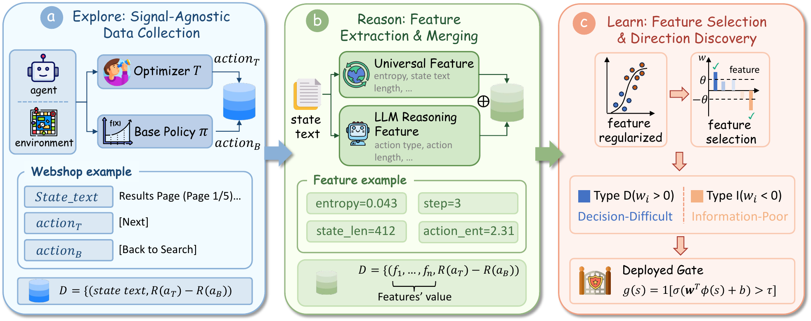
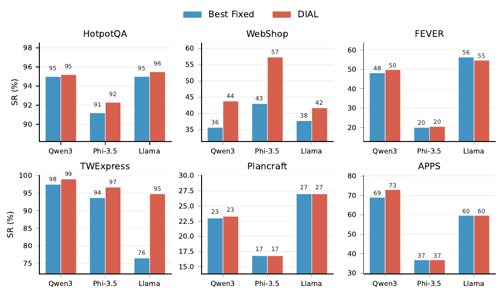
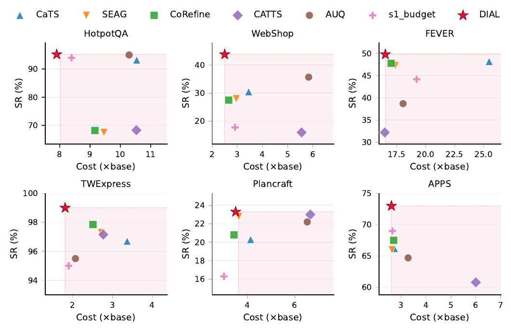

# DIAL: Direction-Informed Adaptive Learning

> Same Signal, Opposite Meaning: Why Adaptive Compute Fails Across Environments — and how a sparse linear gate fixes it.

[](LICENSE)
[](#installation)

DIAL is an adaptive test-time-compute gate for LLM agents. Rather than hardcoding the assumption that *high uncertainty means more rollouts help*, DIAL **learns the signal–utility direction per (environment, backbone) pair from interaction data**, using a randomized exploration phase, a sparse linear classifier, and an optional LLM feature-proposal layer.

Across **6 environments × 3 backbones**, DIAL Pareto-dominates fixed-direction adaptive-compute methods in both success rate and token cost.

<p align="center">
  
</p>

---

## Why this matters

Existing adaptive-gating methods all assume that higher uncertainty consistently indicates when extra computation helps. We measured this assumption across 6 environments and 3 LLM backbones. **It fails on half the environments**, and the *same* uncertainty signal can flip sign across backbones with the task held fixed.

<p align="center">
  
</p>

When the assumed direction is wrong, sharper-ranking gates make things *worse* by triggering more precisely on harmful states. DIAL solves this by **learning the direction from data** rather than baking it in.

<p align="center">
  
  <br/>
  <em>SR vs. Cost (×base) across 6 environments on Qwen3-4B. Shaded region: Pareto-dominated by DIAL.</em>
</p>

---

## Table of contents

- [Installation](#installation)
- [⚡ 30-second smoke test](#-30-second-smoke-test)
- [🔌 Benchmark your own method](#-benchmark-your-own-method)
- [📊 Reproduce paper results](#-reproduce-paper-results)
- [🏗 Extending to a new environment](#-extending-to-a-new-environment)
- [Repository layout](#repository-layout)
- [Citation](#citation)

---

## Installation

```bash
git clone https://github.com/<you>/DIAL.git
cd DIAL
conda create -n dial python=3.10 -y
conda activate dial
pip install -e .
```

Optional environment-specific dependencies (lazy-loaded; install only what you need):

| Environment | Install command |
|---|---|
| HotpotQA  | `pip install datasets` + `bash scripts/data/download_hotpotqa.sh` |
| APPS      | `pip install datasets` |
| WebShop   | `pip install -e ".[webshop]"` + `bash scripts/data/install_webshop.sh` (also installs OpenJDK + spaCy model; see [`docs/INSTALL.md`](docs/INSTALL.md#webshop)) |
| FEVER     | `pip install datasets` |
| TWExpress | `pip install textworld_express` |
| Plancraft | `pip install plancraft` |

For real (non-stub) runs you also need a vLLM-compatible server:
```bash
pip install vllm
bash scripts/start_vllm.sh        # default: Qwen3-4B on port 9300
export DIAL_VLLM_ENDPOINT=http://localhost:9300/v1
```

---

## ⚡ 30-second smoke test

Validate that everything imports and the gate API is wired correctly, without any LLM or env packages:

```bash
python -m dial.benchmark \
    --gate examples/threshold_gate.py:ThresholdGate \
    --stub --episodes 20 --seeds 42
```

You should see a per-env SR / Cost table. If this passes, your install is OK.

---

## 🔌 Benchmark your own method

DIAL ships with a public benchmark interface so other researchers can plug in their own gating methods and get directly comparable numbers — same envs, same cost accounting, same Pareto frontier.

**1. Implement `GateInterface`:**
```python
# my_gate.py
from dial.benchmark import GateInterface, Decision

class MyGate(GateInterface):
    name = "my_method"

    def setup(self, env_name, backbone, explore_data=None):
        # explore_data is a list of pre-collected (signals, utility) records
        # from DIAL's exploration phase — useful for calibration-based methods
        self.threshold = 0.7

    def should_rollout(self, state, signals):
        # signals is a dict of universal features:
        #   token_entropy, action_entropy, step_count, state_length, num_avail_actions
        return Decision(trigger=signals["token_entropy"] > self.threshold)
```

**2. Run the benchmark:**
```bash
python -m dial.benchmark \
    --gate my_gate.py:MyGate \
    --envs hotpotqa,webshop,fever,apps,twexpress,plancraft \
    --backbone qwen3-4b \
    --seeds 42,123,456 \
    --episodes 100 \
    --output results/my_method/
```

**3. Compare against published numbers:**
```bash
python -m dial.benchmark \
    --gate my_gate.py:MyGate --stub \
    --compare paper_results/dial_qwen3-4b.json
```
Output:
```
Environment      ΔSR (pp)     ΔCost (×)
────────────────────────────────────────
hotpotqa            -3.9         +1.2
webshop             +1.1         -0.4
...
```

**Key benchmark guarantees:**
- Cost is computed by the canonical `dial.benchmark.compute_cost` (counts base + gate + rollout tokens; identical to the paper).
- Pre-collected explore data (50 episodes × 6 envs × 3 backbones, ~50 MB) can be downloaded so calibration-based methods skip re-running exploration.
- All output JSON conforms to a fixed schema (`dial.benchmark.schema`), enabling community leaderboard PRs.

See [`docs/extending.md`](docs/extending.md) for full API reference.

---

## 📊 Reproduce paper results

Every paper table and figure has a single command. Results land under `results/`; figure-regen notebooks under `notebooks/`.

| Paper artifact | Command | Output |
|---|---|---|
| **Tab `signal-discovery`** (6×3 ρ matrix) | `sbatch scripts/slurm/run_signal_discovery.sbatch` | `results/signal_discovery/` |
| **Fig `pareto`** + **Tab `full-results`** (DIAL + bounds) | `BACKBONE=qwen3-4b sbatch scripts/slurm/run_dial_main.sbatch` | `results/main/qwen3-4b/` |
| **Tab `wrong-direction`** | `python experiments/run_dial.py --method dial --reverse-weights ...` | `results/wrong_direction/` |
| **Tab `capacity`** (Logistic / MLP / Probe) | `sbatch scripts/slurm/run_capacity_ablation.sbatch` | `results/capacity/` |
| **Tab `controlled`** (P2: InfoPoor/InfoRich) | `sbatch scripts/slurm/run_controlled_reversal.sbatch` | `results/controlled/` |
| **Fig `temporal-shift`** (P1) | `python experiments/two_source_verification.py --p1` | `results/temporal/` |
| **Tab `signal-identity`** (P3) | `python experiments/two_source_verification.py --p3` | `results/signal_identity/` |
| **Appendix regularizer ablation** | `python experiments/regularizer_ablation.py` | `results/regularizer/` |

After all jobs finish, regenerate figures from the JSON results:
```bash
jupyter nbconvert --execute notebooks/pareto_figure.ipynb
```

---

## 🏗 Extending to a new environment

Add a new `BaseEnv` subclass under `dial/envs/`, register it in `dial/envs/registry.py`, and DIAL's universal-feature pool will work automatically:

```python
# dial/envs/my_env.py
from dial.envs.base import BaseEnv, EnvState

class MyEnv(BaseEnv):
    ENV_TYPE = "my_env"
    def reset(self, seed=None): ...
    def step(self, action): ...
    def get_state(self) -> EnvState: ...
    def forward_value(self, action) -> float: ...
    def greedy_oracle_action(self): ...
    # Optional: expose env-specific signals via self.last_signals (dict)
```

```python
# dial/envs/registry.py
ENV_REGISTRY["my_env"] = "dial.envs.my_env.MyEnv"
```

Now `python -m dial.benchmark --envs my_env --gate ...` works on your environment.

---

## Repository layout

```
DIAL/
├── dial/                       # Python package
│   ├── gates/
│   │   ├── dial.py             # ★ Full DIAL (LLM features + LASSO + online decay)
│   │   ├── dial_universal.py   # DIAL with universal features only (ablation)
│   │   ├── probe_gate.py       # Hidden-state probe (capacity ablation)
│   │   └── _scg_base.py        # Common gate base class
│   ├── envs/                   # 6 environment adapters + base interface
│   ├── explore/                # Paired counterfactual rollout, oracle, VoC
│   ├── inference/              # vLLM proposer, HF wrapper
│   ├── benchmark/              # ★ Public GateInterface + harness + cost accounting
│   └── utils/
├── examples/                   # threshold_gate.py, calibrated_gate.py
├── experiments/                # run_dial.py + ablation runners
├── configs/                    # methods/, envs/, controlled/
├── scripts/
│   ├── slurm/                  # SLURM submit scripts (one per paper artifact)
│   ├── data/                   # Dataset download helpers
│   └── start_vllm.sh
├── notebooks/                  # Figure regen
├── paper_results/              # Pre-computed JSON for diffing
└── docs/
    ├── method.md               # Algorithm 1 + math
    ├── extending.md            # GateInterface reference
    ├── INSTALL.md              # Per-env install details
    └── REPRODUCE.md            # Full table-by-table reproduction
```

---

## Method in one paragraph

DIAL has three stages. **(1) Explore:** at each step, with probability ε=0.5 trigger the optimizer T independently of any signal, then label utility by paired counterfactual rollouts (fork env, run base action and T's action from the same state, label which yields higher return). **(2) Reason:** an LLM receives a structured summary of the explore-phase data and proposes up to 5 task-specific feature extractors, joined with universal features (`step_count`, `token_entropy`, `action_entropy`, `state_length`, `num_avail_actions`). **(3) Learn:** fit an ℓ1-regularized logistic regression over the candidate feature pool; the L1 penalty performs feature selection and direction discovery jointly. The deployed gate is a single sigmoid evaluation per step — zero LLM overhead at inference time.

For details and proofs, see the paper or [`docs/method.md`](docs/method.md).


---

## Anonymous review note

This repository is released for double-blind review. It contains no
author names, affiliations, email addresses, or identifying paths.
PDF/PNG figures have been re-emitted with empty XMP/Info metadata.
If you fork the repo and intend to submit results back, please review
your local `git config user.{name,email}` before pushing — the
canonical leaderboard PR template asks for an anonymous handle until
acceptance.


## License

MIT. See [LICENSE](LICENSE).
